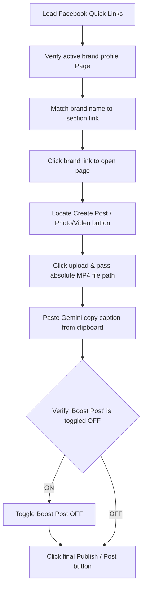

# AI Agent Navigation Workflow & Automation Blueprint

This document describes how an **AI agent** (browser automation, testing harness, or coding assistant driving the UI) should **navigate and automate** the Video Composer dashboard at `/` (single-page app) and the subsequent Facebook publishing pipeline.

---

## 1. Entry URL and Shell Layout

- **Route**: `/` loads `DashboardClient` (client-only dashboard).
- **Header Controls**: “Video Composer” title, tagline, **Sign out** button, and the **theme toggle** (light/dark).
- **Main Layout**: Two-column layout on desktop:
  - **Left column**: Configuration accordions (numbered steps 1–8) + Sticky Export Bar at the bottom.
  - **Right column**: **Preview** accordion containing the live Remotion Player.
- **Mobile Viewports (<1024px)**: Top tab bar switches views between **Configure** (left column) and **Preview** (right column).

---

## 2. Authentication Gate

1. On first visit, a **modal dialog** (`role="dialog"`, title "Sign in") overlays and blocks the dashboard.
2. The form contains a **Password** field (`type="password"`, `name="password"`) and a submit button.
3. **Agent Rule**: Retrieve the current password dynamically from the `SIMULATED_AUTH_PASSWORD` constant in [src/lib/simulated-auth.ts](file:///C:/Users/Yangu/Documents/GitHub/VideoComposer/src/lib/simulated-auth.ts) (default is `webwizards@01`).
4. Programmatic bypass for headless testing: Inject `localStorage.setItem('video-composer-simulated-auth', '1')` into the browser context before loading the URL to skip the modal entirely.

---

## 3. Step Accordion Navigation Pattern

The left column uses collapsible sections. Only **one** configuration step is open at a time (`openLeftStepId`). Clicking a section **header** toggles it open and automatically closes others.

| Step ID      | Title                       | Elements Contained                                                 |
| :----------- | :-------------------------- | :----------------------------------------------------------------- |
| `layout`     | Layout                      | TemplateMode Toggle pills (Before/After, Single, Carousel)         |
| `brand`      | 1. Brand                    | Brand selector grid (driven by `brands.ts` list)                   |
| `logo`       | 2. Logo                     | Brand logo picker dropdown, "Show logo" checkbox, nudge sliders    |
| `colors`     | 3. Video text colors        | Color pickers and hex value input fields for text custom styles    |
| `background` | 4. Background video & music | Dropdowns selecting music tracks and background clips              |
| `text`       | 5. Text & fonts             | Font pickers, subtitle input, price tag toggles, text scale slider |
| `duration`   | 6. Video length             | Video length slider (clamps duration in seconds)                   |
| `photos`     | 7. Images / Slides          | Media upload dropzones (varies by template mode)                   |

The **Preview** section in the right column uses a separate independent accordion ID `preview` and remains open regardless of the left sidebar state.

---

## 4. Recommended Configuration Workflow (Happy Path)

### Step A — Layout selection (`layout`)

Select the layout mode first. **Changing template mode resets uploaded media state**.

- **Before / After** (`before-after`): For comparing transformation states.
- **Single image** (`single-image`): For displaying a hero graphic.
- **Carousel** (`carousel`): For multi-slide portfolio slide shows.

### Step B — Brand selection (`brand`)

Select a brand from the grid. This populates brand defaults and presets the logo folder mapping.

### Step C — Logo settings (`logo`)

- Choose a logo filename from the list.
- Toggle **"Show logo in video"**. If disabled, logo requirements are bypassed on export.

### Step D — Style adjustments (`colors`, `background`, `text`, `duration`)

- Select headline and caption colors.
- Select background video loops and music tracks. **Do not leave these at "none"** (see creative guidelines in [docs/developer-guide.md](file:///C:/Users/Yangu/Documents/GitHub/VideoComposer/docs/developer-guide.md)).
- Set title fonts, subtitle text, price badges, and clamping length in seconds.

### Step E — Media uploads (`photos`)

- **Single Image**: Drop a hero photo. Click **Crop & position** to format it (9:16 aspect ratio).
- **Before / After**: Drop a starting photo in "Before" and a finished photo in "After".
- **Carousel**: Add slide cards (up to `MAX_CAROUSEL_SLIDES`). For each slide, write a title and drop an image.

---

## 5. Crop Modal & AI Copy Assistant Automation

### 5.1 Image Crop Modal Flow

When **Crop & position** is clicked:

1. An overlay modal opens.
2. **Visual Strategy**: Locate the viewport container (`react-easy-crop` container).
3. **Controls**:
   - Zoom Slider: Range input. Automate by setting the value (1.0 to 3.0) or drag-sliding.
   - Crop Aspect Ratios: Click aspect button (e.g. `9:16` or `1:1`).
4. **Action**: Click the primary button **"Apply"** to run canvas cropping and update the local upload blob, or click **"Cancel"** to close.

### 5.2 AI Copy Assistant Generation Flow

1. Scroll down to the **AI copy** step card (last card in the left column).
2. Type or edit context inside the **Brand context** textarea. Click **"Save"** (verifying that it writes to Firestore `brandContexts/{brandId}`).
3. Type the description details in the **Ad prompt** input field.
4. Click **"Generate caption"**.
5. **Loading check**: Detect the spinner/loading status on the button.
6. When the response appears, click the **"Copy"** button to copy the plain-text ad copy block to the clipboard.

---

## 6. Export Execution Flow

1. Verify that the **"Export MP4"** button in the bottom Export Bar is active (checks `canExport` rules).
2. Click **"Export MP4"**.
3. **Progress Tracking**: Scan the progress bar text (polls `/api/render/progress` until it displays "Done" or hits 100%).
4. **File Retrieval**:
   - Do **not** open browser downloads pages (`chrome://downloads`).
   - Run a terminal command to fetch the newest MP4 in the default folder:
     ```bash
     readlink -f "$(ls -t ~/Downloads/*.mp4 | head -1)"
     ```
   - Store the absolute path in memory for publishing.

---

## 7. Facebook Publishing Automation Blueprint

After export, click **"Go to Facebook Pages"** or navigate to `https://wizards-dashboard.vercel.app/facebook.html`.



### Step 1: Switch Profile Page

Ensure that you are publishing as the Facebook Page identity, not a personal account. If prompted by a popup, accept the profile switch.

### Step 2: Select the Brand Link

Locate the matching brand title under the target category header (e.g. "Beauty Salons") on the Quick Links portal. Click the link to open the Facebook Page composer tab.

### Step 3: Upload the Exported Video

1. Click the **"Photo/video"** button inside the page composer block.
2. In the OS file selection modal, paste the absolute path retrieved during the Export flow.
3. Wait for the upload progress indicator to complete.

### Step 4: Add Caption & safety checks

1. Click the description text block and paste the Gemini ad caption copy.
2. **Critical Safety Gate**: Verify the **"Boost post"** (ad budget) toggle is turned **OFF**. If it is turned ON, click to disable it.
3. Click the final **"Post"** or **"Share"** button to publish the reel/ad video.

---

## 8. Common Pitfalls for Automation Scripts

- **Collapsed Accordions**: Attempting to click controls inside a step before clicking the accordion header to expand it.
- **State Erasure**: Selecting the Template layout _after_ uploading images. Layout switches clear files.
- **Partial Carousel Uploads**: Every carousel slide row must have an image before the export button activates.
- **Download Delays**: Grabbing the file from the filesystem before the browser finishes writing it (verify that the file extension is `.mp4` and not `.crdownload` or `.part`).
