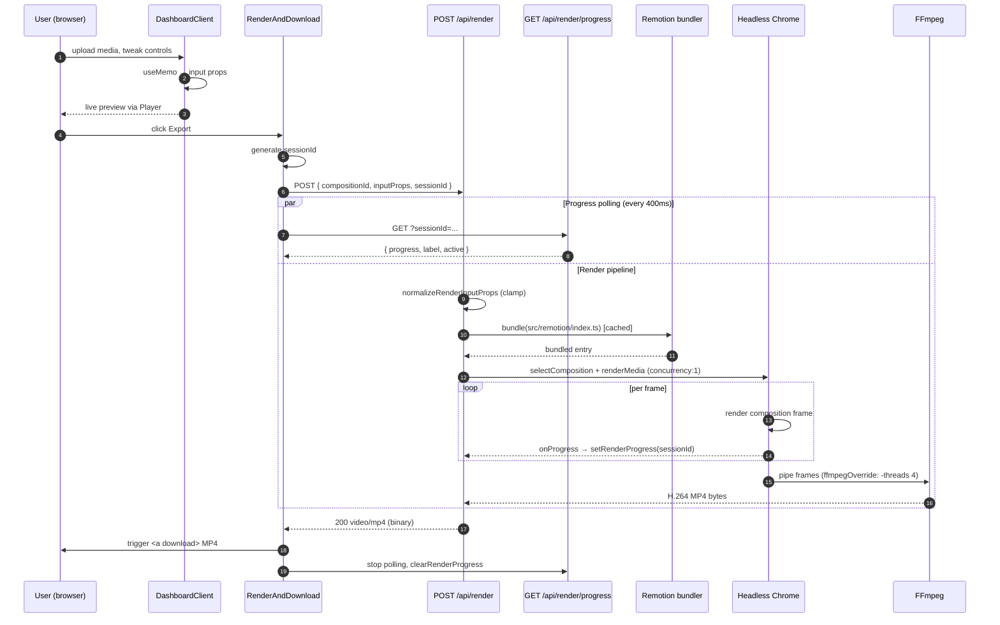

# VideoComposer — architecture diagrams

Three linked views of the same system, all in **Mermaid**. Render in any Mermaid-aware viewer (GitHub, VS Code `Markdown Preview Mermaid Support`, Obsidian, `mmdc`, etc.).

- The full UML **class diagram** lives standalone in [`architecture.mmd`](architecture.mmd) so it can be embedded elsewhere.
- This page adds a **component graph** and an **export sequence** diagram.

---

## 1. UML class diagram

See [`architecture.mmd`](architecture.mmd). Relationships in brief:

- `BaseTemplateProps` is an abstract parent; `BeforeAfter / SingleImage / Carousel` extend it with their unique fields.
- `CarouselTemplateProps` aggregates `CarouselSlide[]`; the dashboard edits a lighter `CarouselSlideDraft[]` (adds `File` + object URL for the uploader) that is converted into `CarouselSlide[]` on export.
- `DashboardClient` owns the state and fans out to `VideoPreview` (live Remotion Player) and `RenderAndDownload` (export path). `RenderAndDownload` hits `RenderApi` and polls `RenderProgressApi`, both of which share an in-memory `RenderProgressSnapshot` store.

---

## 2. Component graph (client UI + Remotion)

```mermaid
flowchart LR
    subgraph Layout [src/app/layout.tsx]
      Theme[ThemeProvider]
      Fonts[Google Fonts link<br/>config/google-fonts.ts]
    end

    Layout --> Page[page.tsx]
    Page --> DC[DashboardClient<br/>src/app/dashboard-client.tsx]

    subgraph Steps [Step accordion]
      direction TB
      S1[1. TemplateModeToggle]
      S2[2. BrandSelector]
      S3a[3. LogoPicker]
      S3b[3. LogoPositionControls]
      S4[4. VideoTextColors]
      S5[5. BackgroundMusicControls]
      S6a[6. ServiceFontPicker]
      S6b[6. VideoTextSizeSlider]
      S7[7. VideoDurationControl]
      S8a[8. MediaUploader x N]
      S8b[8. CarouselSlidesEditor]
    end

    DC --> S1 & S2 & S3a & S3b & S4 & S5 & S6a & S6b & S7 & S8a & S8b
    S8a --> Crop[ImageCropModal]
    S8b --> S8a

    DC --> VP[VideoPreview]
    DC --> RD[RenderAndDownload]
    DC --> Auth[SignInModal]
    DC --> FAB[AiAgentsInstructionFab]

    subgraph Remotion [src/remotion]
      direction TB
      Root[Root.tsx<br/>registers 3 Compositions]
      BA[BeforeAfterTemplate]
      SI[SingleImageTemplate]
      CA[CarouselTemplate]
      BG[BackgroundLayer]
      PT[PriceTagBadge]
      UI[ui-motion.uiLayerMotion]
      MU[media-utils.resolveMediaSrc]
      SF[service-font-loaders]
    end

    VP -. @remotion/player .-> Root
    Root --> BA & SI & CA
    BA & SI & CA --> BG & PT & UI & MU & SF

    subgraph API [src/app/api]
      RAPI[/api/render]
      PAPI[/api/render/progress]
      BAPI[/api/brand-logos/:id]
      MAPI[/api/public-media]
    end

    RD --> RAPI
    RD -. poll .-> PAPI
    S3a --> BAPI
    DC --> MAPI

    RAPI -. bundle + render .-> Root
```

---

## 3. Export sequence (client → Node → MP4)



---

## Rendering tips

- **GitHub** renders Mermaid fences natively; viewing this file on GitHub or any preview that understands Mermaid is enough.
- **CLI** (PNG/SVG): `npx -y @mermaid-js/mermaid-cli -i docs/architecture.mmd -o docs/architecture.svg`.
- The **class diagram** uses `<<type>>` stereotypes for TypeScript union types and `<<abstract>>` for the conceptual `BaseTemplateProps` (there is no runtime base class in code — it's a documentation aid).
