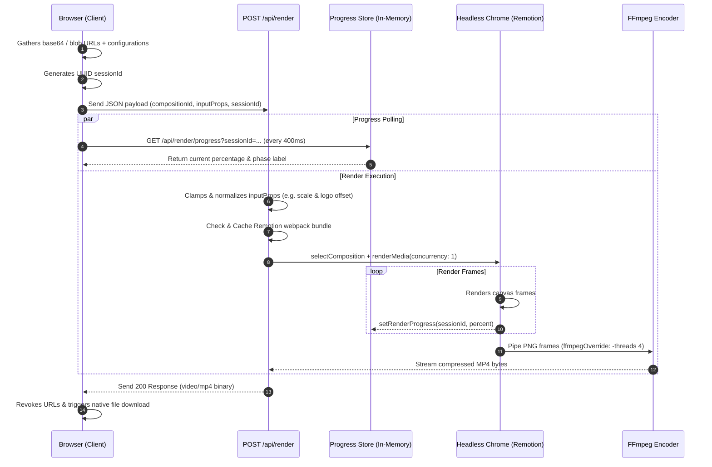

# Video Composer — Developer & Extension Guide

Welcome to the **Video Composer** Developer Guide. This document provides a comprehensive technical walkthrough of the codebase, detailing how the architecture functions, how data flows through the application, and how to extend the system with new brands, fonts, templates, and features.

---

## 1. System Architecture & Directory Map

The Video Composer is built as a single-page Next.js 15 application. It combines a client-side configuration dashboard with a server-side Remotion video rendering pipeline.

### Core Directory Structure

- **[src/app/](file:///C:/Users/Yangu/Documents/GitHub/VideoComposer/src/app)**: Next.js App Router entrypoints and API routes.
- **[src/components/](file:///C:/Users/Yangu/Documents/GitHub/VideoComposer/src/components)**: Client-side UI components (`"use client"`), organized as controlled subcomponents inside the main dashboard client.
- **[src/config/](file:///C:/Users/Yangu/Documents/GitHub/VideoComposer/src/config)**: Type-safe configuration registries and constraint constants. No React code lives here.
- **[src/lib/](file:///C:/Users/Yangu/Documents/GitHub/VideoComposer/src/lib)**: Pure TypeScript helper libraries, containing Firebase bindings, authorization gates, utility tools, and progress state managers.
- **[src/remotion/](file:///C:/Users/Yangu/Documents/GitHub/VideoComposer/src/remotion)**: Compositions, scenes, and templates that Remotion bundles and renders. Used by `@remotion/player` (browser) and `@remotion/renderer` (server).

### Detailed File Index

| Path                                                                                                                               | Description                                                                                                                                |
| :--------------------------------------------------------------------------------------------------------------------------------- | :----------------------------------------------------------------------------------------------------------------------------------------- |
| [src/app/page.tsx](file:///C:/Users/Yangu/Documents/GitHub/VideoComposer/src/app/page.tsx)                                         | Server-side entrypoint; imports and renders `<DashboardClient />`.                                                                         |
| [src/app/dashboard-client.tsx](file:///C:/Users/Yangu/Documents/GitHub/VideoComposer/src/app/dashboard-client.tsx)                 | The **Single State Hub** of the application. Drives the step-by-step accordion and manages all user input.                                 |
| [src/app/globals.css](file:///C:/Users/Yangu/Documents/GitHub/VideoComposer/src/app/globals.css)                                   | Custom Tailwind directives and styles, including safe-area layouts for mobile.                                                             |
| [src/app/api/render/route.ts](file:///C:/Users/Yangu/Documents/GitHub/VideoComposer/src/app/api/render/route.ts)                   | Server route (`POST`) that bundles Remotion, normalizes props, runs headless Chrome, renders frames, and pipes to FFmpeg to export an MP4. |
| [src/app/api/render/progress/route.ts](file:///C:/Users/Yangu/Documents/GitHub/VideoComposer/src/app/api/render/progress/route.ts) | Server route (`GET`) that returns progress updates for active rendering sessions.                                                          |
| [src/hooks/useRender.ts](file:///C:/Users/Yangu/Documents/GitHub/VideoComposer/src/hooks/useRender.ts)                             | Custom hook encapsulating export execution, progress polling, download triggering, and cleanups.                                           |
| [src/remotion/Root.tsx](file:///C:/Users/Yangu/Documents/GitHub/VideoComposer/src/remotion/Root.tsx)                               | Declares the three primary Remotion composition endpoints (`BeforeAfter`, `SingleImage`, `Carousel`).                                      |

---

## 2. Core Design Patterns

### 2.1 The Single-State Hub Model

The configuration state is hosted entirely within [src/app/dashboard-client.tsx](file:///C:/Users/Yangu/Documents/GitHub/VideoComposer/src/app/dashboard-client.tsx). Subcomponents receive their values through props and emit changes via setter callbacks. This design keeps data flow predictable (unidirectional) and guarantees that the Live Preview and the Export pipeline read from the same source of truth.

### 2.2 Live Preview Parity & The Remount Key

The player in [src/components/VideoPreview.tsx](file:///C:/Users/Yangu/Documents/GitHub/VideoComposer/src/components/VideoPreview.tsx) runs `@remotion/player` client-side. Because fonts, typography scale, logo position adjustments, and duration change dynamically, we compute a compound `key` containing these variables:

```typescript
const previewKey = `${templateMode}-${activeBrandId}-${brandTitleFontId}-${serviceFontId}-${textSizeScale}-${logoOffsetXPx}-${logoOffsetYPx}-${durationSeconds}`;
```

Applying this key to the Player container forces React to remount the component on changes, immediately resolving loaded fonts and resetting the animation loop to ensure perfect preview-to-render parity.

### 2.3 Dynamic Webpack Aliases

Next.js parses `@/*` imports via `tsconfig.json`. However, when Remotion bundles the code on the server, it runs its own Webpack process. To resolve typescript path aliases, the bundler imports [src/remotion/webpack-override.ts](file:///C:/Users/Yangu/Documents/GitHub/VideoComposer/src/remotion/webpack-override.ts), mapping `@/` to `src/`.

### 2.4 Animation & Layer Interpolation System

Video Composer features a professional, keyframe-less motion graphics engine powered by Remotion interpolation.

- **Interpolation Helper**: Motion is driven by [src/remotion/ui-motion.ts](file:///C:/Users/Yangu/Documents/GitHub/VideoComposer/src/remotion/ui-motion.ts) using the `uiLayerMotion` function. It calculates staggered enter (fade + slide up) and exit (fade + slide up) values based on the current composition frame.
- **Scaling Adaptability**: The animation lengths scale down proportionally for very short videos:
  $$\text{enterLen} = \max(10, \text{round}(18 \times \text{scale}))$$
  $$\text{exitLen} = \max(10, \text{round}(22 \times \text{scale}))$$
  $$\text{stagger} = \max(4, \text{round}(8 \times \text{scale}))$$
  where $\text{scale} = \min(1.0, \frac{\text{totalFrames}}{72})$.
- **Easing Profiles**: Curves use cubic easing equations:
  - Enter animation: `Easing.out(Easing.cubic)` (smooth decelerate into place).
  - Exit animation: `Easing.in(Easing.cubic)` (smooth accelerate out of frame).
- **Stagger Delays**: Layers are staggered to enter from top to bottom (Title $\rightarrow$ Images $\rightarrow$ Subtitle $\rightarrow$ Service Line) with start delays:
  - Title/Headline: `0` frames
  - Photo Container: `8` frames
  - Subtitle block: `16` frames
  - Service Line caption: `24` frames
- **Continuous Pulsing**: The overlay brand logo continuously pulses to add dynamism. This is done by mapping a sine wave function to a scale transform:
  $$\text{pulse} = \text{interpolate}\left(\sin\left(\frac{\text{frame}}{\text{fps}} \times 2\pi\right), [-1, 1], [0.96, 1.04]\right)$$
  This creates a smooth, breathing scale pulse loop repeating every 30 frames (1 second).

### 2.5 Canvas-Based Image Cropping Pipeline

When a user uploads an image, they can crop it via [src/components/ImageCropModal.tsx](file:///C:/Users/Yangu/Documents/GitHub/VideoComposer/src/components/ImageCropModal.tsx) (powered by `react-easy-crop`).

- **Downscaling Logic**: The cropped coordinates are processed in [src/lib/get-cropped-image.ts](file:///C:/Users/Yangu/Documents/GitHub/VideoComposer/src/lib/get-cropped-image.ts). To maintain performance and prevent excessive memory footprint, the output canvas size is restricted to a maximum dimension of `1920px` while preserving aspect ratio:
  $$\text{scale} = \min\left(1.0, \frac{1920}{\max(\text{cropWidth}, \text{cropHeight})}\right)$$
  $$\text{outWidth} = \text{round}(\text{cropWidth} \times \text{scale})$$
  $$\text{outHeight} = \text{round}(\text{cropHeight} \times \text{scale})$$
- **JPEG Compression**: The cropped canvas is exported as a Blob using `canvas.toBlob()` with `image/jpeg` MIME type and `0.92` quality value, providing an optimal balance of visual crispness and payload size.

### 2.6 AI Copy Assistant Engine

The copywriting panel leverages Gemini 3.5 Flash Low through a server-side proxy route:

- **Constraints**: Brand context is capped at `8000` characters (`MAX_BRAND_CONTEXT_CHARS` in [src/app/api/gemini/route.ts](file:///C:/Users/Yangu/Documents/GitHub/VideoComposer/src/app/api/gemini/route.ts)) and user prompts are capped at `2000` characters to prevent payload injection and stay within API boundaries.
- **Copy Guidelines**: The backend prepends a strict system prompt instructing Gemini to output clean plain-text captions with a hook, message, call to action, and 4–8 hashtags, omitting any Markdown fences.
- **Safety Handling**: If the prompt is blocked by safety filters, the endpoint returns a `422 Unprocessable Entity` status with the specific reason (e.g. `safety block`).

### 2.7 Shared Media Library State Management

When `NEXT_PUBLIC_FIREBASE_*` variables are configured:

- **Lazy Singletons**: Singletons for Firebase App, Firestore, and Storage are initialized lazily inside [src/lib/firebase.ts](file:///C:/Users/Yangu/Documents/GitHub/VideoComposer/src/lib/firebase.ts) only in browser contexts.
- **Real-time Synchronization**: The UI connects to Firestore via `onSnapshot` inside [src/lib/media-library.ts](file:///C:/Users/Yangu/Documents/GitHub/VideoComposer/src/lib/media-library.ts). This ensures that any uploaded or deleted asset immediately synchronizes across active browser tabs and pickers without manual polling.
- **Parallel Chunk Uploads**: Multiple file drops are uploaded in parallel using `uploadBytesResumable`, updating individual progress values dynamically in the state before creating the corresponding metadata documents in the `media` Firestore collection.

---

## 3. End-to-End Rendering Pipeline

The export process moves from raw client-side inputs to a binary MP4 stream.



### 3.1 Input Normalization & Clamping

Before rendering, [src/app/api/render/route.ts](file:///C:/Users/Yangu/Documents/GitHub/VideoComposer/src/app/api/render/route.ts) passes `inputProps` through `normalizeRenderInputProps`. This clamps the scale multiplier and logo offsets to prevent layout breaks on malformed requests:

- `textSizeScale` is clamped using `clampVideoTextSizeScale` from [src/config/video-text-scale.ts](file:///C:/Users/Yangu/Documents/GitHub/VideoComposer/src/config/video-text-scale.ts).
- `logoOffsetXPx` and `logoOffsetYPx` are clamped using `clampLogoOffset` from [src/config/logo-offset.ts](file:///C:/Users/Yangu/Documents/GitHub/VideoComposer/src/config/logo-offset.ts).

### 3.2 Carousel Frame Distribution Math

To guarantee seamless slide transitions in the `Carousel` template without dropping frames, the total duration is divided mathematically among all slides in [src/remotion/carousel-template.tsx](file:///C:/Users/Yangu/Documents/GitHub/VideoComposer/src/remotion/carousel-template.tsx):

- **Base Allocation**:
  $$\text{baseFrames} = \lfloor\frac{\text{compositionDuration}}{\text{slideCount}}\rfloor$$
- **Remainder Frame Distribution**:
  To account for rounding remainders (when `compositionDuration % slideCount != 0`), the remaining frames are distributed one-by-one to the first $R$ slides:
  $$\text{remainder} = \text{compositionDuration} \pmod{\text{slideCount}}$$
  $$\text{slideDuration}_i = \begin{cases} \text{baseFrames} + 1 & \text{if } i < \text{remainder} \\ \text{baseFrames} & \text{otherwise} \end{cases}$$
  This ensures that the sum of all slide durations exactly equals `compositionDuration` and individual slide lengths differ by at most a single frame.

---

## 4. How-To Extension Manual

### 4.1 Adding a New Brand

To register a new brand:

1. Open [src/config/brands.ts](file:///C:/Users/Yangu/Documents/GitHub/VideoComposer/src/config/brands.ts).
2. Append a new object to the `brands` array:

```typescript
{
  id: "noble-car",
  displayName: "Noble Car Rental",
  primaryColor: "text-sky-600",
  primaryHex: "#0284c7",
  logoFolder: "assets/logos/noble-car",
}
```

3. Create the directory `public/assets/logos/noble-car/`.
4. Add a default brand logo (e.g., `logo.svg` or `logo.png`) inside this directory.

> [!NOTE]
> The folder name specified in `logoFolder` is relative to the `public/` directory.

### 4.2 Adding a Headline or Service Font

Google Fonts are preloaded to avoid layout flashes during server rendering.

1. Open [src/config/service-fonts.ts](file:///C:/Users/Yangu/Documents/GitHub/VideoComposer/src/config/service-fonts.ts) and append your font definition:

```diff
export const SERVICE_FONT_OPTIONS = [
  { id: "inter", label: "Inter" },
  ...
+ { id: "outfit", label: "Outfit" },
] as const;
```

2. Open [src/remotion/service-font-loaders.ts](file:///C:/Users/Yangu/Documents/GitHub/VideoComposer/src/remotion/service-font-loaders.ts) and add the corresponding Google Font mapping and preloader:

```diff
export const SERVICE_FONT_CSS: Record<ServiceFontId, string> = {
  inter: "Inter",
  ...
+ outfit: "Outfit",
};

export function preloadAllServiceFonts(): Promise<void> {
  return Promise.all([
    ...
+   import("@remotion/google-fonts/Outfit").then(({ loadFont }) =>
+     loadFont("normal", { ...latin, weights: ["400", "700", "800"] }).waitUntilDone()
+   ),
  ]).then(() => undefined);
}
```

3. Ensure the font is added to the HTML layout loader in [src/config/google-fonts.ts](file:///C:/Users/Yangu/Documents/GitHub/VideoComposer/src/config/google-fonts.ts) to make it available to the browser:

```diff
export const GOOGLE_FONTS_LINK =
  "https://fonts.googleapis.com/css2?family=Bebas+Neue&family=Dancing+Script:wght@700&family=Inter:wght@400;700;800&family=Lato:wght@400;700&family=Montserrat:wght@400;700;800&family=Oswald:wght@700&family=Playfair+Display:wght@700&family=Roboto:wght@400;700&display=swap";
```

### 4.3 Creating and Registering a New Video Template

To create a new Remotion composition (e.g., `GridImageTemplate`):

1. **Define the Types & Component**:
   Create `src/remotion/grid-image-template.tsx`:

```typescript
import type { FC } from "react";
import { useEffect, useState } from "react";
import { AbsoluteFill, useCurrentFrame, useVideoConfig, continueRender, delayRender } from "remotion";
import type { BaseTemplateProps } from "./Root";
import { uiLayerMotion } from "./ui-motion";
import { preloadAllServiceFonts, SERVICE_FONT_CSS } from "./service-font-loaders";

export type GridImageTemplateProps = BaseTemplateProps & {
  leftImageSrc: string;
  rightImageSrc: string;
};

export const GridImageTemplate: FC<GridImageTemplateProps> = ({
  leftImageSrc,
  rightImageSrc,
  textSizeScale,
  titleText,
  headlineColorHex,
  brandTitleFontId,
  durationInFrames,
  // ...other base props
}) => {
  const fs = (px: number) => Math.round(px * textSizeScale);
  const [fontBlock] = useState(() => delayRender());

  useEffect(() => {
    preloadAllServiceFonts()
      .then(() => continueRender(fontBlock))
      .catch(() => continueRender(fontBlock));
  }, [fontBlock]);

  const frame = useCurrentFrame();
  const { fps } = useVideoConfig();

  const motionTitle = uiLayerMotion(frame, durationInFrames, 0, 3);
  const motionPhotos = uiLayerMotion(frame, durationInFrames, 8, 2);

  return (
    <AbsoluteFill className="bg-slate-900 flex flex-col items-center justify-center p-10">
      <div
        style={{
          fontFamily: SERVICE_FONT_CSS[brandTitleFontId as any] || "Inter",
          color: headlineColorHex,
          fontSize: fs(52),
          opacity: motionTitle.opacity,
          transform: `translateY(${motionTitle.translateY}px)`,
        }}
      >
        {titleText}
      </div>
      {/* Photo layout container */}
      <div
        className="flex flex-row gap-6 mt-10 w-full"
        style={{
          opacity: motionPhotos.opacity,
          transform: `translateY(${motionPhotos.translateY}px)`,
        }}
      >
        
        
      </div>
    </AbsoluteFill>
  );
};
```

2. **Register the Composition**:
   Open [src/remotion/Root.tsx](file:///C:/Users/Yangu/Documents/GitHub/VideoComposer/src/remotion/Root.tsx). Add a new `<Composition>` definition:

```typescript
<Composition
  id="GridImage"
  component={GridImageTemplate}
  durationInFrames={DEFAULT_DURATION_FRAMES}
  fps={30}
  width={1080}
  height={1920}
  defaultProps={defaultGridImageProps}
  calculateMetadata={async ({ props }) => {
    const p = props as GridImageTemplateProps;
    return {
      durationInFrames: clampDurationFrames(p.durationInFrames ?? DEFAULT_DURATION_FRAMES),
    };
  }}
/>
```

3. **Map the Template Mode**:
   Open [src/config/template-modes.ts](file:///C:/Users/Yangu/Documents/GitHub/VideoComposer/src/config/template-modes.ts) and add the corresponding ID mappings:

```typescript
export type TemplateModeId = "before-after" | "single-image" | "carousel" | "grid-image";

export function templateModeToCompositionId(mode: TemplateModeId): string {
  if (mode === "grid-image") return "GridImage";
  ...
}
```

4. **Integrate with UI**:
   Update [src/app/dashboard-client.tsx](file:///C:/Users/Yangu/Documents/GitHub/VideoComposer/src/app/dashboard-client.tsx) to capture state inputs specific to the new layout and map them to the inputs payload in `useMemo`.

---

## 5. API Reference

### 5.1 POST `/api/render`

Initiates a server-side video render process and returns the final MP4 binary.

- **Headers**: `Content-Type: application/json`
- **JSON Body Parameters**:

| Name            | Type     | Required                | Description                                                                                          |
| :-------------- | :------- | :---------------------- | :--------------------------------------------------------------------------------------------------- |
| `compositionId` | `string` | Yes                     | Must be `"BeforeAfter"`, `"SingleImage"`, or `"Carousel"`.                                           |
| `sessionId`     | `string` | No (highly recommended) | Session ID (8-128 chars) for tracking rendering progress.                                            |
| `inputProps`    | `object` | Yes                     | Object containing the template variables (e.g. `brandId`, base64 `logoSrc`, colors, title font IDs). |

- **Successful Response**:
  - **Status**: `200 OK`
  - **Headers**: `Content-Type: video/mp4`, `Content-Disposition: attachment; filename="video.mp4"`
  - **Body**: Binary video buffer.

- **Error Responses**:
  - **400 Bad Request**: Missing arguments or validation error (e.g. missing hero image).
  - **503 Service Unavailable**: Export blocked (e.g. on serverless environments).
  - **500 Internal Server Error**: Chrome bundle, browser launch, or FFmpeg encode failure.

---

### 5.2 GET `/api/render/progress`

Enables clients to poll progress on active render streams.

- **Query Parameters**:
  - `sessionId` (string, required): The UUID generated by the client.

- **Response (`200 OK`)**:
  - **Content-Type**: `application/json`
  - **Body**:

```json
{
  "progress": 42,
  "label": "Rendering frames…",
  "active": true
}
```

---

### 5.3 GET `/api/public-media`

Scans `public/music` and `public/backgrounds` and returns accessible asset listings.

- **Response (`200 OK`)**:

```json
{
  "music": [
    { "id": "acoustic", "label": "Acoustic Breeze", "publicPath": "/music/acoustic-breeze.mp3" }
  ],
  "backgrounds": [
    { "id": "gradient", "label": "Clean Gradient", "publicPath": "/backgrounds/gradient.mp4" }
  ]
}
```

---

### 5.4 GET `/api/brand-logos/[brandId]`

Lists files inside the target brand's logo folder.

- **Response (`200 OK`)**:

```json
{
  "folder": "assets/logos/le-motor",
  "files": ["logo.svg", "dark-logo.png"]
}
```

---

### 5.5 POST `/api/gemini`

Proxies prompts and brand contexts to Gemini 3.5 Flash Low to generate ad captions.

- **Headers**: `Content-Type: application/json`
- **JSON Body Parameters**:

| Name           | Type     | Required | Description                                      |
| :------------- | :------- | :------- | :----------------------------------------------- |
| `brandName`    | `string` | Yes      | Target brand title.                              |
| `brandContext` | `string` | Yes      | Background context details for ad copy matching. |
| `userPrompt`   | `string` | Yes      | Prompt describing the ad offer.                  |

- **Response (`200 OK`)**:

```json
{
  "text": "Check out our newest detailing package! 🚗..."
}
```

---

## 6. Troubleshooting & Operational Playbook

### 6.1 Serverless Restrictions

By design, Vercel and Netlify functions do not supply Chrome or FFmpeg runtimes. If deployed there, `/api/render` returns a `503 Service Unavailable`.

- **Fix**: Run in a Docker container (using the included `Dockerfile` and `railway.toml`) on VPS, AWS ECS, or Railway.
- **Bypass**: Setting `REMOTION_ALLOW_EXPORT_ON_SERVERLESS=1` overrides this gate (only do this if you have manually wired up FFmpeg and Chrome binaries).

### 6.2 OOM (Out Of Memory) Terminations

If the render crashes with a `502 Bad Gateway` or logs indicate FFmpeg was terminated with a `SIGKILL`, the server has run out of RAM.

- **Tuned mitigations already in place**:
  - `concurrency: 1` restricts rendering to one page tab.
  - `disallowParallelEncoding: true` pauses FFmpeg composition encoding until all frames are generated.
  - `-threads 4` is injected into FFmpeg arguments via `ffmpegOverride` to prevent thread explosions on high-CPU hosts.
- **Actionable play**: Ensure your hosting environment (e.g. Railway) has **at least 1GB - 2GB of RAM** allocated.

### 6.3 Firebase Storage CORS Failures

If selecting a file from the shared library gets stuck on "Preparing...", check browser console logs. If you see CORS errors:

- Apply the CORS rules using the GCP Cloud SDK utility:

```bash
gcloud storage buckets update gs://YOUR_BUCKET.firebasestorage.app --cors-file=cors.json
```

- Hard refresh the browser page (`Ctrl+F5` or `Cmd+Shift+R`) to clear cached preflight options.

### 6.4 Common Render Error Mappings

When debugging failures from `/api/render`, the API route processes thrown exceptions into human-friendly descriptors using [src/lib/render-error.ts](file:///C:/Users/Yangu/Documents/GitHub/VideoComposer/src/lib/render-error.ts):

| Error Pattern                          | User-Facing Message                                                      | Troubleshooting Steps                                                                                             |
| :------------------------------------- | :----------------------------------------------------------------------- | :---------------------------------------------------------------------------------------------------------------- |
| `/SIGKILL/i`                           | "The render process was killed — the server likely ran out of memory..." | Upgrade container RAM settings. Shorten composition length.                                                       |
| `/SIGTERM\|SIGABRT/i`                  | "The render process was terminated unexpectedly..."                      | Verify CPU utilization and verify no thread limits are violated on the VM host.                                   |
| `/ffmpeg\|chrome\|browser\|headless/i` | "FFmpeg or Remotion's headless browser is missing..."                    | Ensure system dependencies are installed via `Dockerfile`. Locally, verify `ffmpeg -version` works in PATH.       |
| `/Module not found\|Can't resolve/i`   | "A required module is missing in the Docker image..."                    | Verify that `tsconfig.json` mappings mirror webpack overrides and that files are copied in the Docker build step. |
| `/ENOSPC/i`                            | "Not enough disk space to write the video file."                         | Clear host temporary storage `/tmp`.                                                                              |
| `/timeout\|ETIMEDOUT/i`                | "Rendering timed out..."                                                 | Increase API route runtime limits. Reduce composition resolution or framerate.                                    |

---

## 7. Testing & Verification Architecture

The application uses a high-performance verification pipeline designed to prevent build regressions, type mismatches, and styling discrepancies across serverless and headless Chrome render environments.

### 7.1 Vitest Native Test Runner (`npm test`)

The test suite is built on **Vitest v3** (`vitest run`). Why Vitest instead of Node's native test runner?

- **Native ESM & TypeScript Handling**: Next.js and Remotion heavily utilize ES modules and complex TypeScript types. Vitest executes TS files natively without requiring manual CommonJS transpilation flags (`--import tsx`).
- **Mock Hoisting (`vi.hoisted`)**: When mocking Node filesystem calls (`readddir`) or scanner utilities (`scanPublicMedia`) in API route tests, `vi.hoisted()` ensures mock references are initialized prior to module evaluation, preventing Temporal Dead Zone (`ReferenceError`) failures.
- **Speed**: The entire suite of 15 test files (65 tests covering brand parsing, hex normalization, Gemini routing, progress stores, and error mappings) completes in under 3.5 seconds.

### 7.2 The Verification Pipeline (`npm run verify`)

Before deploying or committing changes, developers run `npm run verify`, which executes four sequential health gates:

1. `npm run verify:remotion`: Triggers a headless Remotion webpack bundling check (`scripts/verify-remotion.ts`) to ensure all Remotion compositions compile cleanly.
2. `npm test`: Runs the Vitest test suite.
3. `npm run lint`: Runs ESLint (`eslint .`) across all application and test code while ignoring temporary coverage directories (`coverage/**`).
4. `npm run build`: Compiles optimized Next.js static and dynamic production bundles.

---

## 8. Styling, Theme & Typography System

### 8.1 Global Typography Architecture (`Outfit`)

The application enforces **Outfit** as its global typeface across both UI components and Remotion video exports:

- **Client Application**: Loaded via `next/font/google` inside [src/app/layout.tsx](file:///C:/Users/Yangu/Documents/GitHub/VideoComposer/src/app/layout.tsx). To prevent third-party UI components or CSS resets from overriding the font family, a universal rule (`*, ::before, ::after { font-family: var(--font-outfit), ... }`) is enforced in [src/app/globals.css](file:///C:/Users/Yangu/Documents/GitHub/VideoComposer/src/app/globals.css).
- **Remotion Sync**: Registered in [src/config/service-fonts.ts](file:///C:/Users/Yangu/Documents/GitHub/VideoComposer/src/config/service-fonts.ts) and preloaded inside [src/remotion/service-font-loaders.ts](file:///C:/Users/Yangu/Documents/GitHub/VideoComposer/src/remotion/service-font-loaders.ts) via `@remotion/google-fonts` to guarantee pixel-perfect text layout during headless frame extraction.

### 8.2 Animated Day/Night Theme Toggle

The theme toggle ([src/components/theme-toggle.tsx](file:///C:/Users/Yangu/Documents/GitHub/VideoComposer/src/components/theme-toggle.tsx)) utilizes a custom-designed animated day/night toggle switch replacing generic theme buttons:

- Features CSS-driven sun, moon, cloud, and twinkling star animations.
- Scaled down (`0.2x`, resulting in a compact `60x30px` footprint) via `.google-switch` utility classes in [src/app/globals.css](file:///C:/Users/Yangu/Documents/GitHub/VideoComposer/src/app/globals.css) to fit seamlessly within the dashboard header bar.

### 8.3 Light/Dark Mode High-Contrast Accessibility

To ensure optimal legibility across both light and dark themes, interactive controls (accordion buttons, brand selectors, tweak toggles, AI textareas) adhere to strict dual-theme contrast pairings:

- **Light Mode Defaults**: Inactive buttons use solid light backgrounds with dark slate text (`border-slate-300 bg-slate-100 text-slate-700 hover:bg-slate-200 hover:border-slate-400`). Never use un-namespaced light colors (like `text-slate-200` or `border-white/10`) on light mode backgrounds.
- **Dark Mode Overrides**: Explicitly scoped using the `dark:` prefix (`dark:border-white/10 dark:bg-white/[0.04] dark:text-slate-200 dark:hover:bg-white/[0.07]`).
